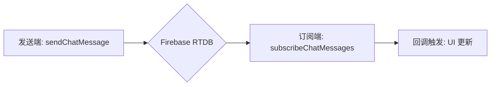

# 聊天系统（Chat）接入指南

本文档描述聊天系统的公共能力与接入方式。

## 📍 模块位置

- `utils/chat.ts`

## 🚀 消息生命周期

## 🛠 API 说明

### `sendChatMessage(path, roomId, message)`

发送一条文本消息，并自动更新房间的 `lastActive` 时间。

### `subscribeChatMessages(path, roomId, limit, cb)`

订阅指定房间的最新 `limit` 条消息。
> [!TIP]
> 建议 `limit` 设置在 50-100 之间，以平衡性能与用户体验。

### `clearChatMessages(path, roomId)`

清空该房间下的所有聊天记录。通常用于房间释放或重新开始游戏时。

---

## ⚡ 性能与优化建议

### 消息历史管理
Firebase 实时数据库在处理极大量子节点时性能会下降。建议：
1. **定期清理**：在游戏结束或房间关闭时调用 `clearChatMessages`。
2. **限制订阅数量**：只展示最近的 50 条消息，旧消息可以通过“加载更多”逻辑（需额外实现）或直接舍弃。

### 昵称显示
> [!NOTE]
> 消息对象中的 `name` 是可选的。如果你的应用有全局的用户系统，建议在发送时带上 `name` 以减少订阅端的额外查表开销。

### 消息频率限制
为了防止恶意刷屏，建议在 UI 层对发送按钮做防抖（Debounce）或频率限制（Throttle）。

---

## 🔗 参考实现

- 聊天组件在各游戏页面中的集成方式可参考房间逻辑。
