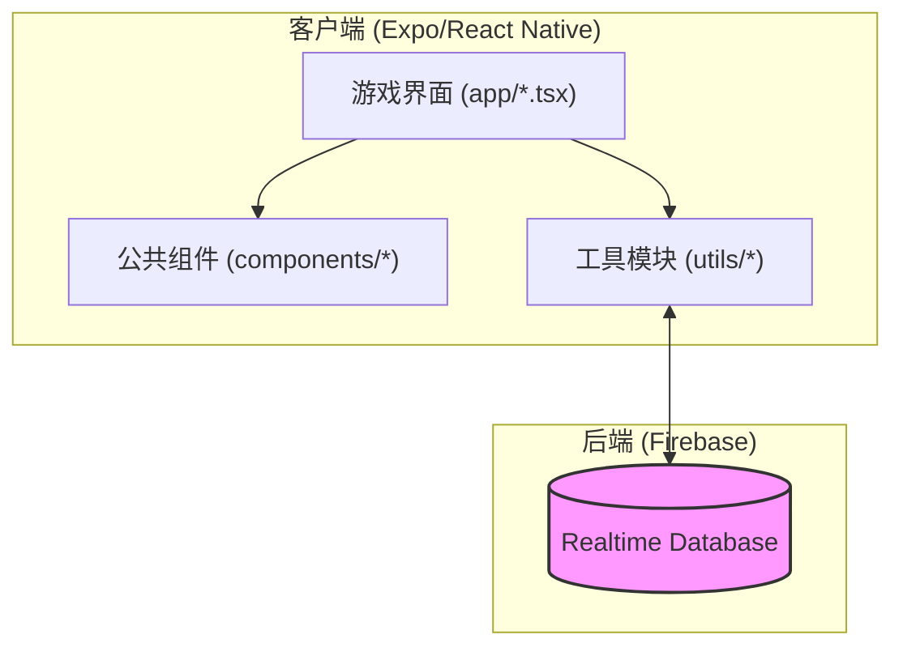

# 模块文档索引

这里是项目核心系统的文档入口。

## 🏗 系统架构

项目采用模块化设计，将 UI 展现与数据逻辑解耦。

## 📚 模块文档

| 模块 | 说明 | 文档链接 |
| :--- | :--- | :--- |
| **房间系统** | 负责房间创建、占位、状态同步、自动清理 | [ROOM.md](ROOM.md) |
| **聊天系统** | 负责实时消息发送、历史记录订阅、频道清理 | [CHAT.md](CHAT.md) |

---

> [!TIP]
> 每一个新游戏建议优先接入 `room.ts` 以获取基础的联机能力。
