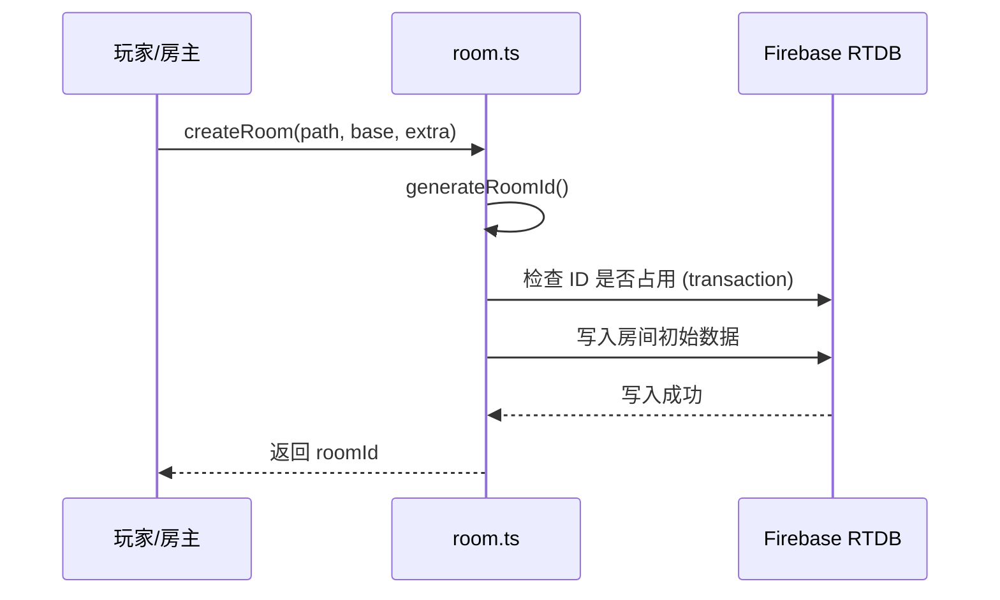
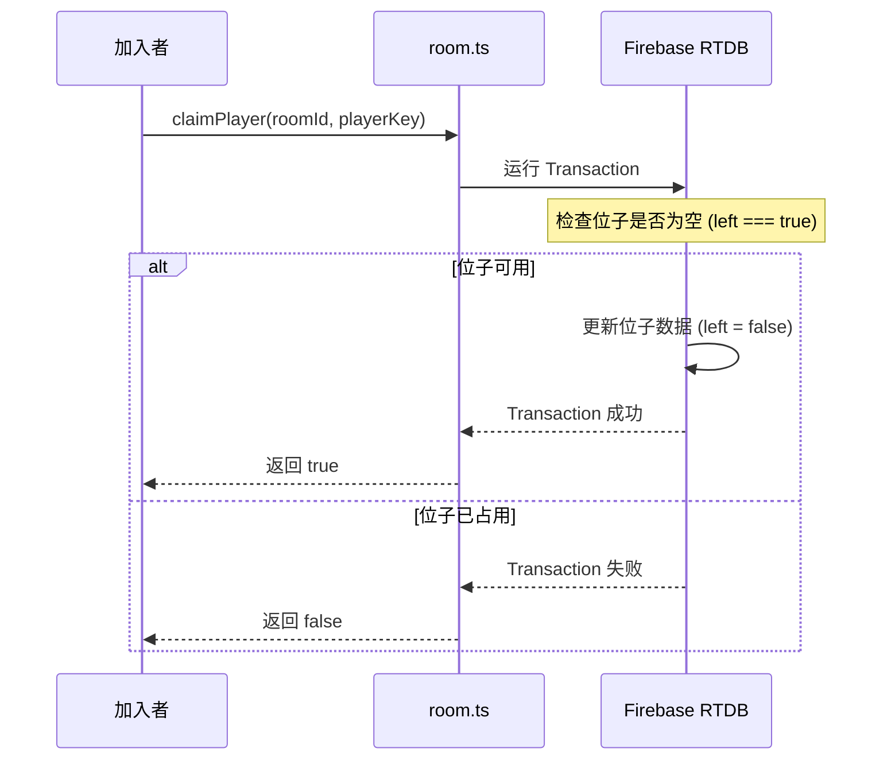

# 房间系统（Room）接入指南

本文档描述房间系统的公共能力与接入方式。

## 📍 模块位置

- `utils/room.ts`

## 🚀 业务流程

### 1. 房间创建流程


### 2. 玩家占位流程


## 🛠 API 说明

### `generateRoomId(path, tries?)`

生成 4 位房间号，内部使用共享计数器降低碰撞率。

### `createRoom(path, base, extra?)`

创建房间。`base` 建议包含：`status`, `createdAt`, `players`。`extra` 存放游戏配置。

### `claimPlayer(path, roomId, playerKey, payload)`

**原子占位**。防止多个玩家同时抢占同一个坑位。

---

## ⚠️ 最佳实践与错误处理

### 离线处理 (Presence)
> [!IMPORTANT]
> 必须在 `useEffect` 中正确清理 `setupPresence` 返回的句柄，否则可能导致状态不准确。

```ts
useEffect(() => {
  const handler = setupPresence('rooms', roomId, 'A', { left: false }, { left: true });
  return () => {
    handler?.cancel(); // 页面卸载时取消断线监听
  };
}, []);
```

### 频繁更新
如果你的游戏需要极高频（如每秒 30 次）更新数据，请考虑将高频数据放在 `extra/sync` 下，并减少不必要的 `onValue` 全量监听。

### 错误捕获
虽然 `room.ts` 内部处理了大部分异常，但建议在 UI 层包装：
```ts
try {
  const id = await createRoom(...);
  if (!id) {
    // 处理生成失败（如网络问题）
    showError("创建房间失败，请检查网络");
  }
} catch (e) {
  console.error(e);
}
```

## 🔗 参考实现

- 🔢 猜数字：`app/guess-number.tsx`
- 💣 猜地雷：`app/mine-guess.tsx`
